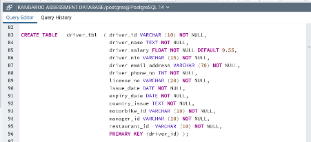

# Kangaroo-database-creation-PostgrelSQL-

## Scenario 

Kangaroo is an online delivery company, which is looking for the development of an effective Relational Database Management System (RDBMS) and data warehouse to satisfy the needs of the growing business. As a data analyst, you have been asked to develop a required system for Kangaroo. 

## Problem Statement 

**_Develop the system that satisfies the following business information requirements_**:

•	The database should contain information about Customers, Items, Restaurants, Orders, Drivers and their Vehicle. For payroll, the National Insurance (NI) number of the drivers is recorded.

•	For each customer, the database should store the Customer ID, Last Name, First Name, Email, and the Phone Number.

•	For each driver, their name, salary, email address and their manager are recorded as well as details of their Driving License such as Driving License Number, Issue Date, country of issue and Expiry Date.

•	Each driver is assigned a motorbike when they start with the company and they normally keep it during the duration of their contract. Details of the motorbike are registered such as Registration Number, colour, date of purchase, engine size etc.

•	Each Manager manages at least one driver, and each driver is associated with one restaurant only, but one restaurant employs many drivers.
•	For each of the Restaurant, the Restaurant ID, Restaurant Name and Address are recorded.

•	For each Item, the Item ID, the Item Name and Item Price should be recorded. The items are divided into four categories such as Starter, Main Course, Deserts and Drinks. Prices for each item/Product may vary in different branches. For example, the Pizza Hut Croydon Branch sells Garlic Bread at £3.50 but the Oxford Street Branch charges £4.00 for the same item.

•	For each order, it is required to store the Order ID, Order date and the Products that have been ordered. A customer must order at least one item per   order.

•	A customer can have one or more orders from the same or different restaurants.

•	A driver can deliver more than one order, but one driver delivers a particular order only.

##  Task One 
Design a relational database using either Chen’s notation or Crow Foot notation, capable of supporting the given business scenario. Your design should include Relationships and any participation constraints.

## Task two 

Write SQL code to implement your database design. You should document your code and use constraints, default values, ON DELETE clauses, etc., as appropriate for the business scenario.  The use of wizards is prohibited.
 
Populate all the tables in the database you created with some data (At least 10 records in each table). The data should be meaningful but does not need to be extensive. 

## Task three 

Explain how database design will support the business scenario. 

## How the system that satisfy the business scenario was developed 

To satisfy the business requirements, a database system should be developed that stores information about Customers, Items, Restaurants, Orders, Drivers, and their Vehicles. For Customers, the system should record their Customer ID, Last Name, First Name, Email, and Phone Number. For Drivers, their name, salary, email address, and their manager should be recorded, as well as details of their Driving License such as Driving License Number, Issue Date, country of issue, and Expiry Date.

Each driver should be assigned a motorbike when they start with the company, and details of the motorbike such as Registration Number, color, date of purchase, engine size, etc., should be registered. Each Manager should manage at least one driver, and each driver is associated with one restaurant only, but one restaurant employs many drivers. For each Restaurant, the system should record the Restaurant ID, Restaurant Name, and Address.

For each Item, the system should record the Item ID, Item Name, and Item Price, and divide items into four categories such as Starter, Main Course, Deserts, and Drinks. Prices for each item/Product may vary in different branches. For each order, the system should store the Order ID, Order date, and the Products that have been ordered. A customer must order at least one item per order. A customer can have one or more orders from the same or different restaurants. A driver can deliver more than one order, but one driver delivers a particular order only. The National Insurance (NI) number of drivers should be recorded for payroll purposes.

Overall, the developed system should be capable of efficiently managing and tracking customer orders, driver deliveries, and restaurant operations.

**_Here are the entities and their attributes_**:

**_Entity: customer_tbl_**

**_Attributes_**:

- customer_id (character varying(10))
- first_name (text)
- last_name (text)
- phone_no (integer)
- email_address (character varying(50))

**_Entity: driver_tbl_**

**_Attributes_**:

- driver_id (character varying(10))
- driver_name (text)
- driver_salary (double precision)
- driver_nin (character varying(15))
- driver_email_address (character varying(70))
- driver_phone_no (integer)
- license_no (character varying(20))
- issue_date (date)
- expiry_date (date)
- country_issue (text)
- motorbike_id (character varying(10))
- manager_id (character varying(10))
- restaurant_id (character varying(10))

**_Entity: item_tbl_**

**_Attributes_**:

- item_id (character varying(10))
- item_name (text)
- item_category (text)
- item_price (double precision)
- restaurant_id (character varying(10))

**_Entity: manager_tbl_**

**_Attributes_**:

- manager_id (character varying(10))
- manager_name (text)

**_Entity: motorbike_tbl_**

**_Attributes_**:

- motorbike_id (character varying(10))
- motorbike_reg (character varying(10))
- colour (text)
- motor_type (text)
- date_purchase (date)
- engine_size (character varying(10))
- restaurant_id (character varying(10))

**_Entity: order_tbl_**

**_Attributes_**:

- order_id (character varying(10))
- order_date (date)
- item_ordered (text)
- customer_id (character varying(10))
- item_id (character varying(10))
- restaurant_id (character varying(10))
- driver_id (character varying(10))

**_Entity: restaurant_tbl_**

**_Attributes_**:

- restaurant_id (character varying(10))
- restaurant_name (text)
- restaurant_branch (text)
- restaurant_address (character varying(70))
- restaurant_post_code (character varying(10))
- manager_id (character varying(10))

TASK TWO: 

**_The ERD was designed using CHEN'S NOTATION_**

**_This design includes the following relationships and participation constraints_**:

- A customer can place multiple orders (1:M relationship)
- An order can include multiple items (M:N relationship)
- An order must be placed by a customer (participation constraint)
- An order must include at least one item (participation constraint)
- A driver can deliver multiple orders (1:M relationship)
- A driver must be assigned to at least one order (participation constraint)
- A manager can manage multiple restaurants (1:M relationship)
- A restaurant can have only one manager (1:1 relationship)
- A restaurant can offer multiple items (1:M relationship)
- A motorbike can be assigned to multiple drivers (1:M relationship)
- A motorbike must be assigned to at least one driver (participation constraint)

Task Two:

**_SQL code to implement your database designed_** 

 CREATE DATABASE kangaroo_database for delivery

**_A screenshot illustrating the creation of the tables is included below, and the complete syntax file has been uploaded for reference_**.

customer Table 

Driver Table 

Item Table 

Manger Table 

Motorbike Table 

Order Table 

Restaurant Table 

